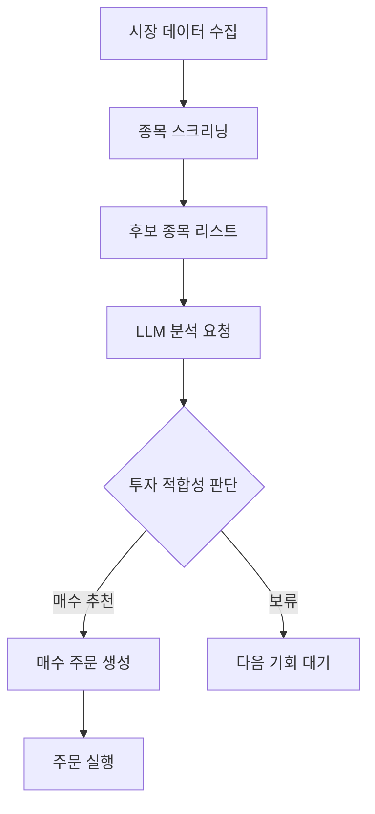
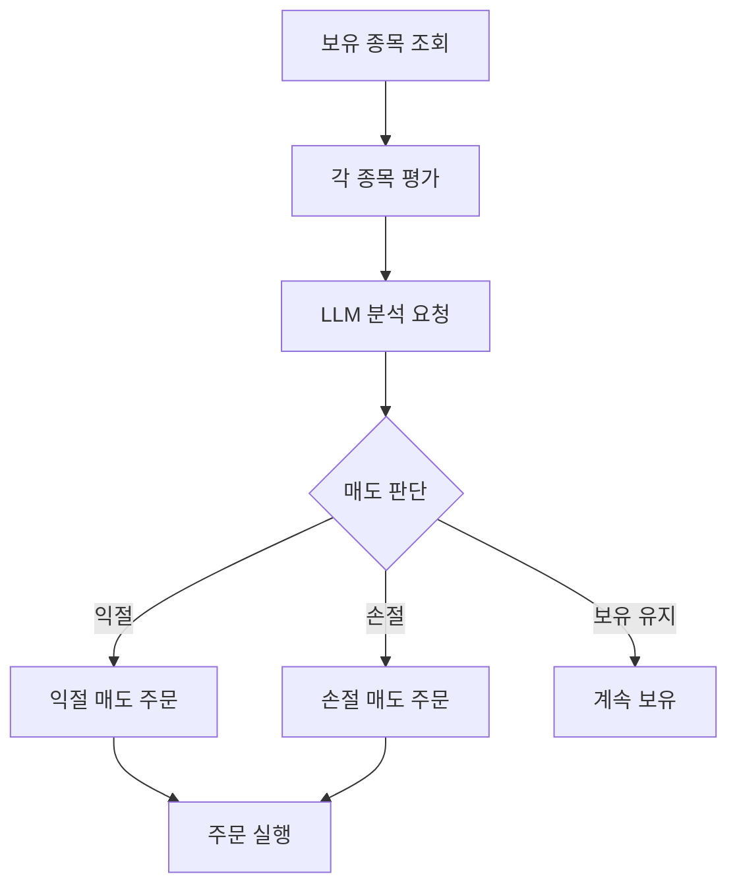

# 🤖 LLM 기반 일일 자동매매 봇

## 📋 프로젝트 개요

LLM(Large Language Model)을 활용하여 **매일 장 개장 시간에 자동으로 실행**되어 매수/매도 판단을 수행하는 지능형 주식 투자 봇.

> 💡 **핵심 컨셉**: 하루에 한 번, 장 시작 시 LLM이 시장을 분석하고 투자 결정을 내린 후 자동으로 주문을 실행

---

## 🎯 핵심 기능

### 1. 매수 분석 및 실행
- 시장/뉴스/재무 데이터 기반 종목 스크리닝
- LLM이 매수 후보 종목 분석 및 추천
- 추천 종목 자동 매수 주문 실행

### 2. 매도 분석 및 실행
- 현재 보유 종목 평가
- LLM이 매도 타이밍 판단 (익절/손절)
- 매도 결정 종목 자동 매도 주문 실행

### 3. 리스크 관리
- 일일 최대 거래 한도 설정
- 포트폴리오 비중 관리
- 손절 라인 자동 적용

---

## ⏰ 운영 스케줄

```
┌─────────────────────────────────────────────────────────────┐
│                    📅 일일 실행 플로우                        │
├─────────────────────────────────────────────────────────────┤
│                                                             │
│  08:30  🔔 시스템 기동                                       │
│         ├── 전일 시장 데이터 수집                             │
│         └── 뉴스/공시 데이터 수집                             │
│                                                             │
│  08:45  🧠 LLM 분석 시작                                     │
│         ├── 보유 종목 평가 → 매도 후보 선정                    │
│         └── 신규 종목 분석 → 매수 후보 선정                    │
│                                                             │
│  09:00  📈 장 개장 (동시호가 종료)                            │
│         ├── 매도 주문 실행                                    │
│         └── 매수 주문 실행                                    │
│                                                             │
│  09:05  📊 주문 체결 확인 및 로깅                              │
│                                                             │
│  15:30  📉 장 마감                                           │
│         └── 일일 성과 리포트 생성                             │
│                                                             │
└─────────────────────────────────────────────────────────────┘
```

> ⚠️ **한국 주식시장 운영 시간**: 09:00 ~ 15:30 (공휴일/주말 휴장)

---

## 🏗️ 시스템 아키텍처

```
┌─────────────────────────────────────────────────────────────┐
│                    ⏰ 스케줄러 (APScheduler)                  │
│                   매일 08:30 자동 실행                        │
└─────────────────────────────────────────────────────────────┘
                              │
                              ▼
┌─────────────────────────────────────────────────────────────┐
│                    📊 데이터 수집 레이어                       │
│  ┌─────────────┐  ┌─────────────┐  ┌─────────────┐         │
│  │ 시장 데이터 │  │ 뉴스/공시   │  │ 보유 종목   │          │
│  │ (KIS API)  │  │ (RSS/크롤링) │  │ (KIS API)  │          │
│  └─────────────┘  └─────────────┘  └─────────────┘         │
└─────────────────────────────────────────────────────────────┘
                              │
                              ▼
┌─────────────────────────────────────────────────────────────┐
│                    🧠 LLM 분석 엔진 (OpenAI gpt-5-nano)       │
│  ┌──────────────────────┐  ┌──────────────────────┐        │
│  │   � 매수 분석기      │  │   📉 매도 분석기      │        │
│  │  - 종목 스크리닝      │  │  - 보유종목 평가     │        │
│  │  - 투자 매력도 평가   │  │  - 익절/손절 판단    │        │
│  │  - 목표가/손절가 제시 │  │  - 매도 우선순위     │        │
│  └──────────────────────┘  └──────────────────────┘        │
└─────────────────────────────────────────────────────────────┘
                              │
                              ▼
┌─────────────────────────────────────────────────────────────┐
│                    💰 주문 실행 레이어                        │
│              (한국투자증권 Open Trading API)                  │
│  ┌─────────────┐  ┌─────────────┐  ┌─────────────┐         │
│  │ 매수 주문   │  │ 매도 주문   │  │ 잔고 조회   │          │
│  └─────────────┘  └─────────────┘  └─────────────┘         │
└─────────────────────────────────────────────────────────────┘
                              │
                              ▼
┌─────────────────────────────────────────────────────────────┐
│                    � 알림 및 리포트                          │
│              (Telegram / 로그 파일 / 대시보드)                │
└─────────────────────────────────────────────────────────────┘
```

---

## 📁 프로젝트 구조

```
i-am-the-best-investor/
├── agent.md                    # 📋 프로젝트 계획 (현재 파일)
├── .env                        # 🔐 API 키 (gitignore)
├── open-trading-api/           # 📚 한국투자증권 API 레퍼런스 (클론됨)
│
├── src/
│   ├── __init__.py
│   │
│   ├── data/                   # 📊 데이터 수집
│   │   ├── __init__.py
│   │   ├── market_data.py      # 시장/주가 데이터 수집 (KIS API)
│   │   ├── news_data.py        # 뉴스/공시 데이터 수집
│   │   └── portfolio_data.py   # 보유 종목/잔고 조회
│   │
│   ├── analysis/               # 🧠 LLM 분석
│   │   ├── __init__.py
│   │   ├── buy_analyzer.py     # 매수 후보 분석
│   │   ├── sell_analyzer.py    # 매도 후보 분석
│   │   └── prompts.py          # LLM 프롬프트 템플릿
│   │
│   ├── trading/                # 💰 거래 실행
│   │   ├── __init__.py
│   │   ├── kis_client.py       # 한국투자증권 API 클라이언트
│   │   ├── order_executor.py   # 주문 실행
│   │   └── risk_manager.py     # 리스크 관리
│   │
│   ├── scheduler/              # ⏰ 스케줄러
│   │   ├── __init__.py
│   │   └── daily_job.py        # 일일 실행 작업
│   │
│   └── utils/                  # 🔧 유틸리티
│       ├── __init__.py
│       ├── logger.py           # 로깅
│       ├── config.py           # 설정 관리
│       └── discord_bot.py      # 알림 및 사용자 명령 (Discord)
│
├── logs/                       # 📝 로그 파일
├── data/                       # 💾 로컬 데이터 저장
├── tests/                      # 🧪 테스트 코드
├── requirements.txt            # 📦 의존성
└── main.py                     # 🚀 메인 실행 파일
```

---

## 🔧 기술 스택

| 분류 | 기술 | 용도 |
|------|------|------|
| **언어** | Python 3.11+ | 메인 개발 언어 |
| **LLM** | OpenAI gpt-5-nano | 투자 분석 및 판단 |
| **증권 API** | 한국투자증권 Open API | 시세 조회, 주문 실행 |
| **스케줄링** | APScheduler | 일일 자동 실행 |
| **데이터** | pandas, SQLite | 데이터 처리 및 저장 |
| **알림** | discord.py | 실시간 알림 및 사용자 명령 |
| **HTTP** | requests, httpx | API 호출 |
| **로깅** | loguru | 구조화된 로깅 |
| **뉴스 수집** | feedparser, BeautifulSoup | RSS/웹 크롤링 |
| **환경 관리** | uv | 빠른 의존성 관리 |
| **클라우드** | GCE / AWS | 프로덕션 배포 |

---

## 📡 외부 데이터 수집

### 데이터 소스 및 수집 방법

| 데이터 종류 | 소스 | 수집 방법 | 용도 |
|------------|------|----------|------|
| **실시간 주가** | 한국투자증권 | REST API | 현재가, 호가, 거래량 |
| **종목 정보** | 한국투자증권 | REST API | 기업 기본 정보 |
| **뉴스** | 네이버 금융/한경 | RSS + 크롤링 | 시장 동향 파악 |
| **재무 데이터** | pykrx | Python 패키지 | 재무제표, 실적 |
| **시장 지표** | 한국투자증권 | REST API | 코스피, 코스닥 지수 |

### 뉴스 수집 예시

```python
# RSS 피드로 금융 뉴스 수집
NEWS_SOURCES = {
    "네이버_금융": "https://news.google.com/rss/search?q=코스피&hl=ko",
    "한국경제": "https://www.hankyung.com/feed/stock",
}
```

---

## 💬 Discord 봇 사용법

### 🚀 실행 방법

```bash
# 방법 1: 스케줄러 + 디스코드 봇 함께 실행 (권장)
uv run python main.py --with-discord

# 방법 2: 디스코드 봇만 실행
uv run python main.py --discord-bot

# 방법 3: 스케줄러만 실행 (웹훅 알림만)
uv run python main.py
```

> ⏰ **월요일 8시 전에 켜두면** 08:30에 자동으로 매매 분석 시작!

### 📢 봇 → 사용자 (자동 알림)

| 알림 종류 | 발송 시점 | 내용 |
|----------|----------|------|
| 🔔 **시스템 시작** | 08:30 | 봇 기동 알림 |
| 📰 **시장 브리핑** | 08:30 | 뉴스 + 종목 현황 |
| 📈 **매수 실행** | 09:00~ | 종목, 수량, **판단 이유** |
| 📉 **매도 실행** | 09:00~ | 종목, 수량, **판단 이유** |
| 📊 **일일 리포트** | 작업 완료 시 | 평가금액, 손익 |
| ⚠️ **에러 알림** | 즉시 | 오류 발생 시 |

### 💬 사용자 → 봇 (명령어)

Discord 채널에서 다음 명령어 입력:

| 명령어 | 설명 | 예시 |
|--------|------|------|
| `/status` | 봇 상태 확인 | `/status` |
| `/portfolio` | 포트폴리오 조회 | `/portfolio` |
| `/analyze 종목코드` | LLM 종목 분석 | `/analyze 005930` |
| `/news` | 최신 뉴스 조회 | `/news` |
| `/stop` | 오늘 거래 중지 | `/stop` |
| `/resume` | 거래 재개 | `/resume` |

### 📱 명령어 예시

```
/analyze 005930

🔍 005930 분석 중...
📊 삼성전자 (005930) 분석 결과
현재 투자 매력도: 중상
단기 전망: AI 반도체 수주 확대로 긍정적...
매수/매도/관망: 관망
```

```
/portfolio

📊 포트폴리오
💰 총 평가금액: 100,000,000원
💵 예수금: 100,000,000원

📭 보유 종목 없음
```

---

## 🧠 LLM 분석 프로세스

### 매수 분석 플로우



### 매도 분석 플로우



### LLM 프롬프트 구조 (예시)

```python
SELL_ANALYSIS_PROMPT = """
당신은 전문 주식 투자 분석가입니다.

## 현재 보유 종목 정보
{portfolio_data}

## 각 종목별 정보
- 매수가: {buy_price}
- 현재가: {current_price}
- 수익률: {profit_rate}%
- 보유 기간: {holding_days}일

## 최근 뉴스 및 공시
{news_data}

## 분석 요청
각 보유 종목에 대해 다음을 분석해주세요:
1. 매도 추천 여부 (매도/보유)
2. 매도 추천 시 사유 (익절/손절/리밸런싱)
3. 추천 매도가격
4. 확신도 (1-10)

JSON 형식으로 응답해주세요.
"""
```

---

## 💰 한국투자증권 API 연동

### API 키 설정 (.env)

```bash
# 한국투자증권 API (실계좌)
real_account_api_key=your_real_account_app_key
real_account_api_secret=your_real_account_app_secret

# 한국투자증권 API (모의투자)
fake_account_api_key=your_fake_account_app_key
fake_account_api_secret=your_fake_account_app_secret

# OpenAI API
OPENAI_API_KEY=your_openai_key

# Discord 봇 (양방향 소통)
DISCORD_BOT_TOKEN=your_discord_bot_token
DISCORD_WEBHOOK_URL=your_discord_webhook_url
```

### 주요 사용 API

| 기능 | API | 설명 |
|------|-----|------|
| **잔고 조회** | 주식잔고조회 | 보유 종목 및 평가액 조회 |
| **시세 조회** | 주식현재가 시세 | 종목별 현재가 조회 |
| **매수 주문** | 주식주문(현금) | 매수 주문 실행 |
| **매도 주문** | 주식주문(현금) | 매도 주문 실행 |
| **체결 조회** | 주식일별주문체결조회 | 주문 체결 확인 |

> 📚 **API 문서**: [한국투자증권 API 레퍼런스](https://apiportal.koreainvestment.com/apiservice-summary)

> 💻 **GitHub**: [한국투자증권 Open Trading API](https://github.com/koreainvestment/open-trading-api)

---

## 📅 개발 로드맵

### Phase 1: 환경 구축 ✅
- [x] 프로젝트 구조 설정
- [x] 한국투자증권 API 레포지토리 클론
- [x] API 키 설정 (.env)
- [ ] requirements.txt 작성
- [ ] 기본 로깅 시스템 구축

### Phase 2: 데이터 수집 레이어
- [ ] KIS API 클라이언트 구현 (kis_client.py)
- [ ] 잔고/보유종목 조회 기능
- [ ] 시세 데이터 조회 기능
- [ ] 뉴스/공시 수집 기능

### Phase 3: LLM 분석 엔진
- [ ] OpenAI API 연동
- [ ] 매수 분석 프롬프트 설계
- [ ] 매도 분석 프롬프트 설계
- [ ] 응답 파싱 및 검증

### Phase 4: 거래 실행
- [ ] 매수 주문 기능
- [ ] 매도 주문 기능
- [ ] 체결 확인 기능
- [ ] 리스크 관리 로직

### Phase 5: 스케줄링 및 자동화
- [ ] APScheduler 설정
- [ ] 일일 실행 작업 구현
- [ ] 장 휴일 판단 로직

### Phase 6: 알림 및 모니터링
- [ ] Telegram 알림 연동
- [ ] 일일 성과 리포트
- [ ] 에러 알림

---

## ⚠️ 리스크 관리

### 거래 한도 설정
```python
RISK_CONFIG = {
    "max_buy_per_day": 3,           # 하루 최대 매수 종목 수
    "max_position_ratio": 0.2,       # 종목당 최대 비중 (20%)
    "stop_loss_rate": -0.05,         # 손절 라인 (-5%)
    "take_profit_rate": 0.15,        # 익절 라인 (+15%)
    "max_daily_loss": -0.03,         # 일일 최대 손실 (-3%)
}
```

### 안전 장치
- [ ] 모의투자로 최소 1개월 검증 후 실거래 적용
- [ ] 일일 최대 손실 도달 시 자동 거래 중단
- [ ] 주문 실행 전 최종 확인 로직
- [ ] 모든 거래 내역 로깅 및 백업

---

## 🚀 실행 방법

### 1. 환경 설정 (uv 사용)
```bash
# uv 설치 (이미 설치되어 있다면 생략)
curl -LsSf https://astral.sh/uv/install.sh | sh

# 의존성 설치 및 실행 (한 번에!)
uv sync
```

### 2. API 키 설정
`.env` 파일에 API 키 입력 (위 설정 참조)

### 3. 모의투자 모드로 테스트
```bash
# 환경변수로 모의투자 모드 설정
export TRADING_MODE=paper

# 실행
uv run python main.py
```

### 4. 스케줄러 실행 (실거래)
```bash
# 환경변수로 실거래 모드 설정 (주의!)
export TRADING_MODE=real

# 백그라운드 실행
nohup uv run python main.py > logs/bot.log 2>&1 &
```

---

## ☁️ 클라우드 배포 (Docker)

### Docker 빌드 및 실행

```bash
# 이미지 빌드
docker build -t trading-bot .

# 로컬 테스트 (모의투자)
docker run --env-file .env -e TRADING_MODE=paper trading-bot

# 실거래 모드
docker run -d --env-file .env -e TRADING_MODE=real --name trading-bot trading-bot
```

### 배포 옵션

| 플랫폼 | 장점 | 적합 상황 |
|--------|------|----------|
| **GCE (Google Cloud)** | 간편한 VM 설정, 안정적 | 시작 추천 |
| **AWS EC2** | 다양한 인스턴스 옵션 | 확장성 필요시 |
| **Google Cloud Run** | 서버리스 컨테이너 | 일일 1회 실행에 적합 |

### GCE + Docker 배포

```bash
# 1. VM 인스턴스 생성 (e2-micro 무료 티어)
gcloud compute instances create trading-bot \
  --machine-type=e2-micro \
  --zone=asia-northeast3-a

# 2. Docker 설치 (VM 접속 후)
sudo apt-get update && sudo apt-get install -y docker.io

# 3. 이미지 빌드 및 실행
docker build -t trading-bot .
docker run -d --env-file .env -e TRADING_MODE=real --restart=always trading-bot
```

### 필수 환경변수 (클라우드)
```bash
TRADING_MODE=real
OPENAI_API_KEY=your_key
DISCORD_BOT_TOKEN=your_token
# ... 기타 API 키 (.env 파일 또는 환경변수로 전달)
```

---

## ✅ 구현 완료 (2024-12-13)

### 완료된 모듈

| 모듈 | 파일 | 상태 | 설명 |
|------|------|:----:|------|
| **설정 관리** | `src/utils/config.py` | ✅ | 환경변수, API 키, 계좌번호 |
| **로깅** | `src/utils/logger.py` | ✅ | loguru 기반 파일/콘솔 로깅 |
| **KIS API** | `src/trading/kis_client.py` | ✅ | 토큰, 잔고, 시세, 매수/매도 |
| **LLM 분석** | `src/analysis/llm_analyzer.py` | ✅ | 매수/매도 분석 (gpt-5-nano) |
| **뉴스 수집** | `src/data/news_fetcher.py` | ✅ | RSS 기반 뉴스 (API 키 불필요) |
| **종목 스크리닝** | `src/data/stock_screener.py` | ✅ | 코스피 + 흑자 기업 필터 |
| **Discord 알림** | `src/utils/discord_bot.py` | ✅ | 웹훅 알림 + 봇 명령어 |
| **스케줄러** | `src/scheduler/daily_job.py` | ✅ | 일일 실행 플로우 |
| **메인** | `main.py` | ✅ | 진입점, CLI 옵션 |

### 테스트 결과

```
✅ Discord 웹훅 발송
✅ KIS API 토큰 발급 (24시간 유효)
✅ 시세 조회 (삼성전자: 108,900원)
✅ 잔고 조회 (모의투자 1억원)
✅ LLM 분석 (매수/매도/개별종목)
✅ 뉴스 수집 (15개)
✅ 전체 플로우 실행
```

---

## 🛠️ 트러블슈팅

### ❌ 일부 종목 시세 조회 500 에러

**증상:**
```
Server error '500 Internal Server Error' for url 
'https://openapivts.koreainvestment.com:29443/...'
```

**원인:**
1. **장 마감 후 (15:30 이후)**: 모의투자 서버는 장 외 시간에 일부 종목 조회 불가
2. **모의투자 서버 제약**: 실전 서버보다 지원 종목이 적음

**해결책:**
- 장 중 (09:00~15:30)에 테스트하면 정상 동작
- 실전 모드(`TRADING_MODE=real`)에서는 대부분 정상 조회

**영향 없는 종목:**
- 삼성전자 (005930) ✅
- SK하이닉스 (000660) ✅
- 현대차 (005380) ✅
- POSCO홀딩스 (005490) ✅

---

## 📝 다음 단계

- [ ] 장 중 실시간 테스트
- [ ] 모의투자 1개월 백테스팅
- [ ] 클라우드 배포 (GCE Docker)
- [ ] 실거래 적용

---

> 💡 **Tip**: 반드시 모의투자로 충분히 검증한 후에 실제 투자에 적용하세요!

> ⚠️ **면책사항**: 이 프로그램으로 인한 투자 손실에 대해 책임지지 않습니다. 투자는 본인 판단과 책임하에 진행하세요.
